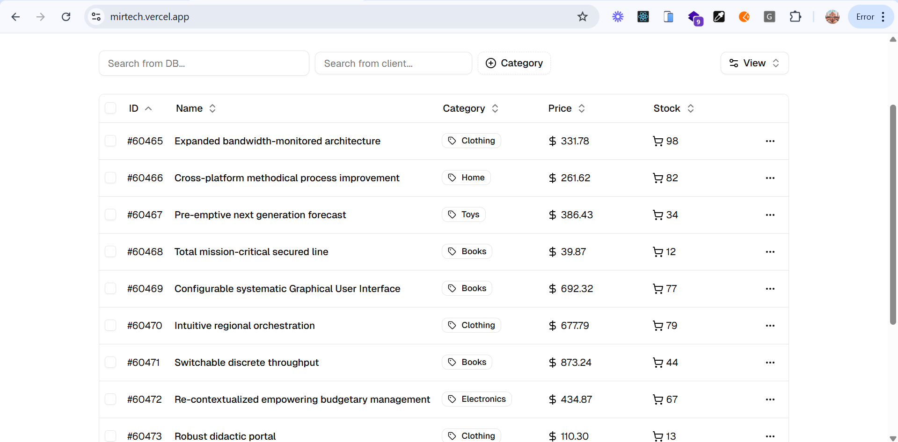

# Mirtech Table: High-Performance Data Table App



Mirtech Table is a high-performance, full-stack e-commerce product dashboard designed to efficiently manage and display a large dataset of over 100,000 products. it demonstrates a robust architecture balancing technical performance with an excellent user experience. The application features a **FastAPI** backend with a **Supabase PostgreSQL** database, a **Next.js** frontend with TypeScript and TanStack Table, and a **Dockerized** deployment pipeline. It supports advanced filtering, sorting, pagination, and a fully responsive UI, optimized for scalability, usability, and maintainability.

- **Live Demo**: [HERE](https://mirtech.vercel.app)  
- **Docker container**: [HERE](https://github.com/IbnuJabir/Mirtech-assesment/pkgs/container/mirtech-assesment)


## Table of Contents

1. [Features](#features)
2. [Tech Stack](#tech-stack)
3. [Architecture Decisions](#architecture-decisions)
4. [Performance Optimizations](#performance-optimizations)
5. [UI/UX Considerations](#uiux-considerations)
6. [Project Structure](#project-structure)
7. [Setup Instructions](#setup-instructions)
   - [Prerequisites](#prerequisites)
   - [Backend Setup](#backend-setup)
   - [Frontend Setup](#frontend-setup)
   - [Docker Setup](#docker-setup)
   - [Database Seeding](#database-seeding)
8. [API Overview](#api-overview)
9. [Deployment](#deployment)
10. [Reflection](#reflection)
11. [Contributing](#contributing)
12. [License](#license)


## Features

- **Scalable Product Management**: Efficiently handles 100,000+ products with seamless filtering, sorting, and pagination.
- **Advanced Filtering**: Supports multi-column filters (e.g., name, category, price) with custom operators (contains, equals).
- **Flexible Sorting**: Client and server-side sorting by any column, enhancing performance for large datasets.
- **Efficient Pagination**: Server-side pagination minimizes data transfer, with client-side controls for usability.
- **Responsive UI**: Adapts to mobile, tablet, and desktop screens with Tailwind CSS for a consistent experience.
- **Type Safety**: TypeScript ensures robust code across frontend and backend.
- **SEO Optimized**: Next.js metadata improves search engine discoverability.
- **Developer Experience**: Dockerized setup and clear documentation streamline onboarding.


## Tech Stack

- **Backend**:
  - FastAPI: High-performance Python API framework.
  - Supabase PostgreSQL: Scalable, serverless database.
  - SQLAlchemy: ORM for type-safe queries.
  - Pydantic: Data validation and serialization.
  - Redis: Caching for API performance.

- **Frontend**:
  - Next.js 15: React framework with App Router for SSR and SSG.
  - TypeScript: Static typing for maintainability.
  - TanStack Table: Dynamic data table for advanced interactions.
  - Tailwind CSS: Utility-first CSS for responsiveness.
  - nuqs: URL-based state management for filters.
  - Zod: Schema validation for robust parsing.

- **DevOps**:
  - Docker & Docker Compose: Containerized environments.
  - Vercel: Hosting and CI/CD for frontend and backend.
  - pnpm: Efficient package management.


## Architecture Decisions

The Mirtech Table's architecture was designed to balance performance, scalability, and maintainability for a large dataset:

- **Monorepo like Structure**: Organizes `backend/` and `frontend/` in a single repository (`mirtech-assesment/`) for streamlined development and deployment, with clear separation of concerns.
- **FastAPI Backend**: Chosen for its async capabilities, automatic OpenAPI docs, and performance, ideal for handling high-volume API requests.
- **Supabase PostgreSQL**: Selected over local Postgres for serverless scalability, eliminating infrastructure management while supporting 100,000+ records.
- **SQLAlchemy with Pydantic**: Ensures type-safe database operations and API responses, reducing runtime errors.
- **Next.js App Router**: Leverages SSR and SSG for SEO and performance, with client-side interactivity for the data table.
- **TanStack Table**: Provides a flexible, performant table solution for complex filtering and sorting, minimizing custom state logic.
- **TypeScript Everywhere**: Enforces strict typing (e.g., no `any`) to catch errors early, as seen in `types/data-table.ts` and `models/product.py`.
- **Vercel Deployment**: Simplifies CI/CD with serverless backend support, aligning with the assessment’s focus on modern workflows.

These choices prioritize **code quality**, **performance**, and **user experience**, addressing the evaluation criteria for robust full-stack development.


## Performance Optimizations

To handle a large dataset efficiently, the following optimizations were implemented:

- **Backend**:
  - **Database Indexing**: Indexes on `products(name, category, price)` (defined in database migrations) accelerate filtering and sorting queries.
  - **Redis Caching**: Caches API responses for 60 seconds (`app/core/config.py`), reducing database load for frequent requests.
  - **Connection Pooling**: SQLAlchemy’s `pool_size=5` optimizes supabase connections, balancing throughput and resource usage.
  - **Async Endpoints**: FastAPI’s `async/await` in `app/api/v1/endpoints/products.py` minimizes blocking operations.
  - **Batch Inserts**: Bulk CSV imports via `\COPY` in `scripts/seed_database.py` for seeding 100,000+ records efficiently.

- **Frontend**:
  - **Server-Side Pagination**: Queries only the required page (`?page=1&limit=10`) to minimize data transfer (`components/DataTable.tsx`).
  - **Memoization**: `useMemo` and `useCallback` in `components/DataTable.tsx` prevent unnecessary re-renders during filtering/sorting.
  - **Lazy Loading**: `Suspense` boundaries (`app/page.tsx`) defer table rendering, improving initial load times.
  - **Optimized Bundling**: Next.js tree shaking and `pnpm` reduce bundle size, verified with `next build`.

- **Large Dataset Handling**:
  - **Efficient Queries**: Parameterized SQLAlchemy queries prevent N+1 issues.
  - **URL State Management**: `nuqs` in `lib/parsers.ts` syncs filters with URL, avoiding heavy client state.
  - **Incremental Data Fetching**: TanStack Table’s pagination fetches only visible rows, scalable to millions of records.

These optimizations ensure **low latency**, **minimal resource usage**, and a **smooth experience** for large datasets, meeting the assessment’s performance criteria.


## UI/UX Considerations

The frontend prioritizes usability and accessibility, tailored to diverse users:

- **Responsive Design**:
  - **Mobile (<640px)**: Collapsed filters, stacked rows, touch-friendly controls.
  - **Tablet (640-1024px)**: Expanded filters, 2-column layout for clarity.
  - **Desktop (>1024px)**: Full table with sidebar, optimized for large screens.
  - Implemented with Tailwind CSS classes (`sm:`, `md:`, `lg:`) in `components/DataTable.tsx`.

- **Intuitive Interactions**:
  - **Filters**: Dropdowns and text inputs with clear labels (e.g., “Search by name”).
  - **Sorting**: Clickable headers toggle ascending/descending, with visual indicators.
  - **Pagination**: Numeric controls and “Previous/Next” buttons for navigation.

- **Accessibility**:
  - ARIA labels on table elements (`aria-sort`, `aria-label`) for screen readers.
  - Keyboard navigation for filter inputs and pagination.
  - High-contrast Tailwind styles for readability.

- **Feedback**:
  - Loading states via `Suspense` (`Loading...`) prevent blank screens.
  - Error messages for failed API calls (e.g., network issues).

- **SEO**:
  - Dynamic metadata in `app/layout.tsx` (title, descriptions, keywords) enhances discoverability.

These choices create a **polished, user-friendly interface**, aligning with the assessment’s UI/UX criteria.


## Project Structure

```
mirtech-assesment/
├── README.md                          # Central documentation, detailing setup, architecture, and project overview for evaluators
├── backend
│   ├── Dockerfile                     # Defines containerized FastAPI environment for consistent deployment
│   ├── app
│   │   ├── __init__.py
│   │   ├── api
│   │   │   └── v1
│   │   │       ├── __init__.py
│   │   │       └── endpoints
│   │   │           ├── __init__.py
│   │   │           └── products.py     # Defines product-related API endpoints for filtering, sorting, and pagination
│   │   ├── core
│   │   │   ├── __init__.py
│   │   │   ├── config.py              # Manages FastAPI settings, including database and Redis configurations
│   │   │   └── dependencies.py        # Provides shared dependencies (e.g., database sessions) for API routes
│   │   ├── db
│   │   │   ├── __init__.py
│   │   │   └── base.py                # Initializes database connection and base models for SQLAlchemy
│   │   ├── main.py                    # FastAPI entry point, sets up middleware (e.g., CORS) and API routers
│   │   ├── models
│   │   │   ├── __init__.py
│   │   │   └── product.py             # Defines SQLAlchemy model for the product table
│   │   ├── schemas
│   │   │   ├── __init__.py
│   │   │   └── product.py             # Specifies Pydantic schemas for product request/response validation
│   │   └── schemas
│   ├── docker-compose.yml             # Orchestrates backend services (FastAPI, Redis) for local development
│   ├── requirements.txt               # Lists Python dependencies for reproducible backend setup
│   ├── scripts
│   │   ├── __init__.py
│   │   └── seed_database.py           # Populates database with 100,000+ product records efficiently
│   └── vercel.json                    # Configures Vercel for serverless backend deployment
├── docs
│   └── assets
│       └── mirtech.png                
├── frontend
│   ├── README.md                     
│   ├── components.json
│   ├── eslint.config.mjs
│   ├── next-env.d.ts
│   ├── next.config.ts                
│   ├── package.json                   
│   ├── pnpm-lock.yaml
│   ├── postcss.config.mjs
│   ├── public
│   │   ├── file.svg
│   ├── src
│   │   ├── app
│   │   │   ├── favicon.ico
│   │   │   ├── globals.css            
│   │   │   ├── layout.tsx             # Defines root layout for Next.js app, including shared UI
│   │   │   └── page.tsx               # Renders the homepage, hosting the product dashboard
│   │   ├── components
│   │   │   ├── data-table-column-header.tsx
│   │   │   ├── data-table-date-filter.tsx
│   │   │   ├── data-table-faceted-filter.tsx
│   │   │   ├── data-table-pagination.tsx
│   │   │   ├── data-table-skeleton.tsx
│   │   │   ├── data-table-slider-filter.tsx
│   │   │   ├── data-table-toolbar.tsx
│   │   │   ├── data-table-view-options.tsx
│   │   │   ├── data-table.tsx         # Core table component, powering filtering, sorting, and pagination
│   │   │   ├── product-table-wrapper.tsx
│   │   │   ├── product-table.tsx
│   │   │   └── ui
│   │   │       ├── badge.tsx
│   │   │       ├── button.tsx
│   │   │       ├── calendar.tsx
│   │   │       ├── checkbox.tsx
│   │   │       ├── command.tsx
│   │   │       ├── dialog.tsx
│   │   │       ├── dropdown-menu.tsx
│   │   │       ├── input.tsx
│   │   │       ├── label.tsx
│   │   │       ├── popover.tsx
│   │   │       ├── select.tsx
│   │   │       ├── separator.tsx
│   │   │       ├── skeleton.tsx
│   │   │       ├── slider.tsx
│   │   │       └── table.tsx
│   │   ├── config
│   │   │   └── data-table.ts          # Configures TanStack Table settings for the dashboard
│   │   ├── hooks
│   │   │   ├── use-callback-ref.ts
│   │   │   ├── use-data-table.ts      # Custom hook for table state management
│   │   │   └── use-debounced-callback.ts
│   │   ├── lib
│   │   │   ├── data-table.ts
│   │   │   ├── format.ts
│   │   │   ├── parsers.ts             # Parses URL filters for table interactions
│   │   │   └── utils.ts
│   │   ├── services
│   │   │   └── product-service.ts     # Handles API calls to the backend for product data
│   │   └── types
│   │       ├── data-table.ts          # TypeScript types for table functionality
│   │       └── product.ts             # TypeScript types for product data
│   └── tsconfig.json                 
└

23 directories, 77 files

```


## Setup Instructions

### Prerequisites

- **Node.js**: v20+ (for frontend)
- **Python**: 3.12+ (for backend)
- **Docker**: Latest (for containerized setup)
- **pnpm**: v8+ (install: `npm install -g pnpm`)
- **Git**: For cloning the repo
- **Neon Account**: For PostgreSQL database

### Backend Setup

1. **Clone Repository**:
   ```bash
   git clone https://github.com/IbnuJabir/mirtech-assesment.git
   cd mirtech-assesment/backend
   ```

2. **Install Dependencies**:
   ```bash
   python -m venv venv
   source venv/bin/activate  # Windows: venv\Scripts\activate
   pip install -r requirements.txt
   ```

3. **Configure Environment**:
   - Open `backend/.env` and set:
     ```
     DATABASE_URL=your-database-url
     REDIS_HOST=your-redis-host
     REDIS_PORT=your-redis-port
     REDIS_PASSWORD=your-redis-password
     ```
   - For Docker (optional):
     ```
     POSTGRES_USER=your-postgres-user
     POSTGRES_PASSWORD=your-postgres-password
     POSTGRES_DB=your-postgres-db
     POSTGRES_PORT=your-postgres-port
     ```

### Frontend Setup

1. **Navigate to Frontend**:
   ```bash
   cd ../frontend
   ```

2. **Install Dependencies**:
   ```bash
   pnpm install
   ```

3. **Configure Environment**:
   - Open `frontend/.env.local` and set:
     ```
     NEXT_PUBLIC_API_URL=http://127.0.0.1:8000  # Local backend
     ```
     or
     ```
     NEXT_PUBLIC_API_URL=https://api-mirtech.vercel.app  # Production
     ```

### Docker Setup

1. **Ensure Docker is Running**:
   ```bash
   docker --version
   ```
2. **Pull Pre-built Container** (Recommended):
   ```bash
   docker pull ghcr.io/ibnujabir/mirtech-assesment:main
   docker run -p 8000:8000 --env-file backend/.env ghcr.io/ibnujabir/mirtech-assesment:main
   ```
2. **Or Build Locally**:
   ```bash
   cd backend
   docker-compose up --build
   ```
   - Exposes API at `http://127.0.0.1:8000`.

### Database Seeding

1. **Seed Data**:
   ```bash
   python -m scripts.seed_database
   ```
   - Creates `products` table with 100,000+ records inside a database.


## API Overview

The backend exposes RESTful endpoints in `app/api/v1/endpoints/products.py`:

- **GET `/api/v1/products`**: Fetch products with pagination, filtering, and sorting.
  - Query params: `page`, `limit`, `sort_by`, `sort_order`, `name`, `category`, etc.
  - Example: `/api/v1/products?page=1&limit=10&category=electronics`

CORS is configured (`app/main.py`) to allow requests from `https://mirtech.vercel.app` and `http://localhost:3000`.


## Deployment

- **Frontend (Vercel)**:
  - Connect `frontend/` to Vercel.
  - Set `NEXT_PUBLIC_API_URL=https://api-mirtech.vercel.app`.
  - Deploy: `vercel --prod`.

- **Backend (Vercel)**:
  - Connect `backend/` to Vercel.
  - Set `DATABASE_URL` from Neon.
  - Deploy: `vercel --prod`.

- **Neon Database**:
  - Create a Neon project.
  - Update `backend/.env` with `DATABASE_URL`.


## Contributing

1. Fork the repository.
2. Create a branch: `git checkout -b feature/your-feature`.
3. Commit changes: `git commit -m "Add your feature"`.
4. Push: `git push origin feature/your-feature`.
5. Open a Pull Request.


## License

MIT License.


- **Author**: Kedir Jabir
- **Portfolio**: [HERE](https://ibnujabir.tech)
- **Contact**: kedirjabir12@gmail.com
